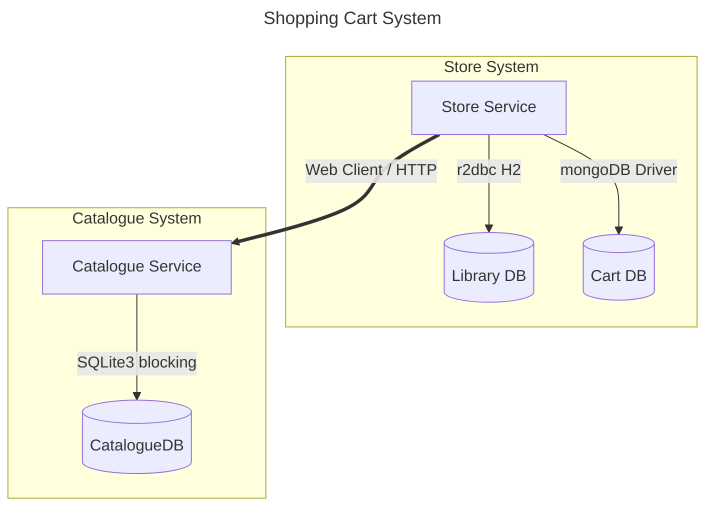

# Reactive Game Store Purchase System

Mini-project simulating a video game store system using reactive and legacy components, for educational purposes.

The system covers:

- Adding and removing games from an active shopping cart
    - Validations about game existence, availability and already in cart
- Updating the user's display name
- Aggregating real-time prices, discounts, availability, and library status per item

## Requirements

- Docker or Podman
- Docker Compose or Podman Compose
- Java 21 (for manual deployment)
- Python 3.13 (for manual deployment)

### Optional

- [IntelliJ Mermaid Plugin](https://plugins.jetbrains.com/plugin/30432-mermaid-visualizer): To visualize mermaid diagrams in IntelliJ
- [VSCode MermaidChart](https://open-vsx.org/vscode/item?itemName=MermaidChart.vscode-mermaid-chart): To visualize mermaid diagrams in VSCode

## System Architecture



## Services

* **[Store Service]** (`Java 21 / Spring Boot WebFlux`): Read [Store Service README.md](./store-service/README.md)
* **[Catalogue Service]** (`Python 3.13 / Flask`): Read [Catalogue Service README.md](./catalogue-service/README.md)

## API Endpoints Summary

### Store Service (`:8080`)

| Method   | Path                   | Description                                       |
|----------|------------------------|---------------------------------------------------|
| `GET`    | `/cart`                | Get active cart with enriched prices and statuses |
| `GET`    | `/cart/history`        | Get all carts (history)                           |
| `POST`   | `/cart/items`          | Add a game to the active cart                     |
| `DELETE` | `/cart/items/{itemId}` | Remove a game from the active cart                |
| `PUT`    | `/user/name`           | Update the current user's display name            |

### Catalogue Service (`:5000`)

| Method  | Path          | Description             |
|---------|---------------|-------------------------|
| `GET`   | `/games`      | List all games          |
| `GET`   | `/games/{id}` | Get a game by ID        |
| `PATCH` | `/games/{id}` | Update a game's details |

## Deployment

### Option 1: Containers

```bash
docker compose up -d
# or using Podman
podman compose up -d
```

*This starts all three services: `store-service` on `http://localhost:8080`, `catalogue-service` on `http://localhost:5000`, and MongoDB on `localhost:27017`.*

#### Cleanup (Docker/Podman)

```bash
docker compose down -v
# podman alternative
podman compose down -v
```

### Option 2: Manual Deployment

1. MongoDB Database
   Ensure a local MongoDB server is running on your machine:

- Host: `localhost`
- Port: `27017`
- Database: `cart_db`

2. Start the Catalogue Service (Python Flask)

```bash
cd catalogue-service
pip install -r requirements.txt
python run.py
```

*Runs on `http://localhost:5000`.*

3. Start the Store Service (Spring Boot)
   Open a new terminal:

```bash
cd store-service
mvn spring-boot:run
```

*Runs on `http://localhost:8080`.*

## Testing Guide — Add Item to Cart Scenarios

When the `store-service` starts, `SqlDataInitializer` automatically seeds the following state:

| Resource | Details |
|----------|---------| 
| **User** | `USER-001` named `MeloDev` |
| **Library** | Contains `GAME-005` and `GAME-007` (already owned games) |
| **MongoDB** | One cart `CART-001` in `CLOSED` status with `GAME-001` |

> ⚠️ There is **no** `ACTIVE` cart at startup.

The `catalogue-service` database is **re-seeded on every startup** with the following games:

| Game ID    | Name                       | Price   | Available | Discount | Active Discount |
|------------|----------------------------|---------|-----------|----------|-----------------|
| `GAME-001` | The Witcher 4              | $60.00  | ✅        | 10%      | ✅              |
| `GAME-002` | Cyberpunk 2078 ⏱️          | $50.00  | ✅        | 0%       | ❌              |
| `GAME-003` | Stardew Valley 2           | $20.00  | ✅        | 25%      | ✅              |
| `GAME-004` | Hollow Knight: Silksong ⏱️ | $30.00  | ✅        | 0%       | ❌              |
| `GAME-005` | Half-Life 3 ⏱️             | $70.00  | ❌        | 0%       | ❌              |

> ⏱️ These games introduce artificial latency of 2–3 seconds on `GET /games/{id}`.

The table below summarizes the key scenarios for `POST /cart/items`. Run them in order for the full flow:

| # | Scenario | Game | Service Call | Expected Result | HTTP |
|---|----------|------|--------------|-----------------|------|
| 1 | First item — no active cart exists | `GAME-003` | `POST :8080/cart/items` | ✅ New cart created with item | `200` |
| 2 | Second item — active cart exists | `GAME-001` | `POST :8080/cart/items` | ✅ Item appended to existing cart | `200` |
| 3 | Game does not exist in catalogue | `GAME-999` | `POST :8080/cart/items` | ❌ `GameNotFoundException` | `404` |
| 4 | Game exists but is unavailable *(slow — 2-3s latency)* | `GAME-005` | `GET :5000/games/GAME-005` → `POST :8080/cart/items` | ❌ `GameNotAvailableException` | `400` |
| 5 | Game already in cart *(intentional unhandled exception)* | `GAME-003` | `POST :8080/cart/items` | 💥 `GameAlreadyInCartException` — default Spring 500 | `500` |
| B | Game already owned in library | `GAME-007` | `POST :8080/cart/items` → `GET :8080/cart` | ⚠️ Added but enriched with `OWNED` status | `200` |
