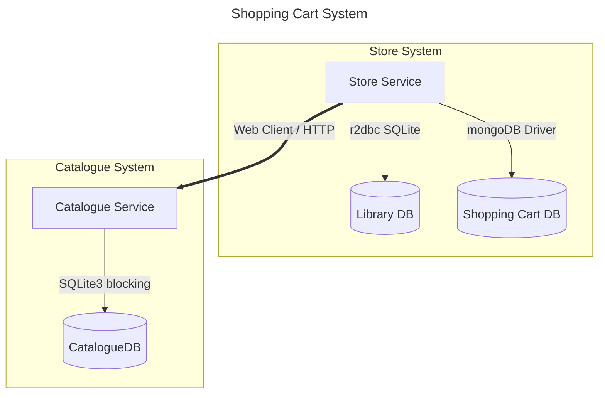

# Reactive Game Store Purchase System

Mini-project about a video game store system using reactive and legacy components, for educational purposes.

We are going to simulate: 
- In cart placement 
- aggregating price, discounts and availability, validating in library status, purchase allowed, totals, and disclaimers

## Requirements
- Docker or Podman
- Docker Compose or Podman Compose
- Java 17 (for manual deployment)
- Python 3.13 (for manual deployment)

## Optional
- [IntelliJ Mermaid Plugin](https://plugins.jetbrains.com/plugin/30432-mermaid-visualizer): To visualize mermaid diagrams in intelliJ
- [VSCode MermaidChart](https://open-vsx.org/vscode/item?itemName=MermaidChart.vscode-mermaid-chart): To visualize mermaid diagrams in VSCode

# System architecture

