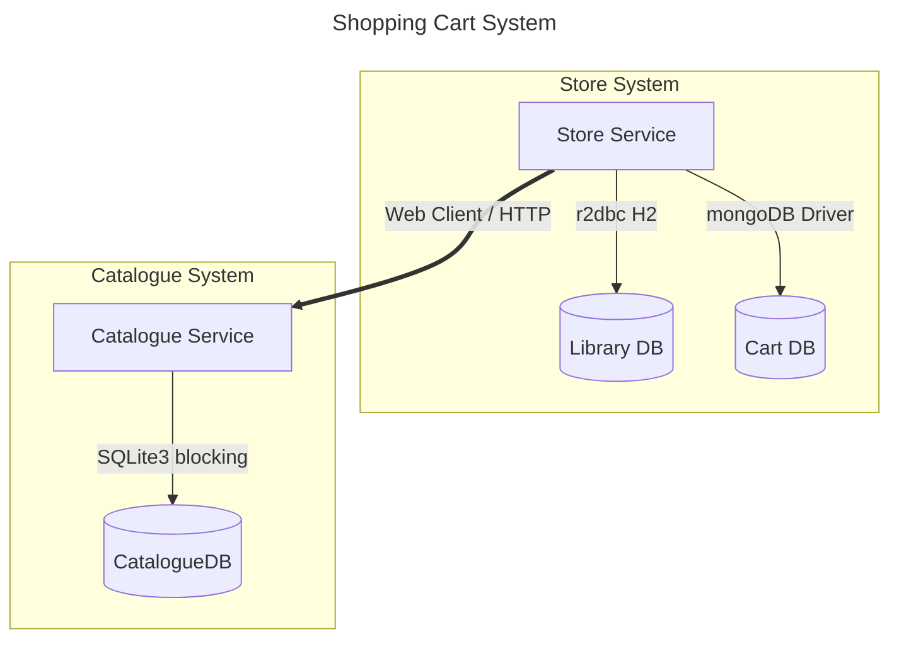

# Reactive Game Store Purchase System

Mini-project about a video game store system using reactive and legacy components, for educational purposes.

We are going to simulate: 
- In cart placement 
- aggregating price, discounts and availability, validating in library status, purchase allowed, totals, and disclaimers

## Requirements
- Docker or Podman
- Docker Compose or Podman Compose
- Java 21 (for manual deployment)
- Python 3.13 (for manual deployment)

### Optional
- [IntelliJ Mermaid Plugin](https://plugins.jetbrains.com/plugin/30432-mermaid-visualizer): To visualize mermaid diagrams in IntelliJ
- [VSCode MermaidChart](https://open-vsx.org/vscode/item?itemName=MermaidChart.vscode-mermaid-chart): To visualize mermaid diagrams in VSCode

## System Architecture



## Services 

*  **[Store Service]** (`Java 21 / Spring Boot WebFlux`): Read [Store Service README.md](./store-service/README.md)
*  **[Catalogue Service]** (`Python 3.13 / Flask`): Read [Catalogue Service README.md](./catalogue-service/README.md)

## Deployment

### Option 1: Containers
```bash
docker compose up -d
# or using Podman
podman compose up -d
```
*This starts the `store-service` on `http://localhost:8080`, `catalogue-service` on `http://localhost:5000`, and MongoDB on `localhost:27017`.*

#### Cleanup (Docker/Podman)
```bash
docker compose down -v
# podman alternative
podman compose down -v
```

### Option 2: Manual Deployment

1. MongoDB Database
Ensure a local MongoDB server is running on your machine:
- Host: `localhost`
- Port: `27017`
- Database: `cart_db`

2. Start the Catalogue Service (Python Flask)
```bash
cd catalogue-service
pip install -r requirements.txt
python run.py
```
*Runs on `http://localhost:5000`.*

3. Start the Store Service (Spring Boot)
Open a new terminal:
```bash
cd store-service
mvn spring-boot:run
```
*Runs on `http://localhost:8080`.*