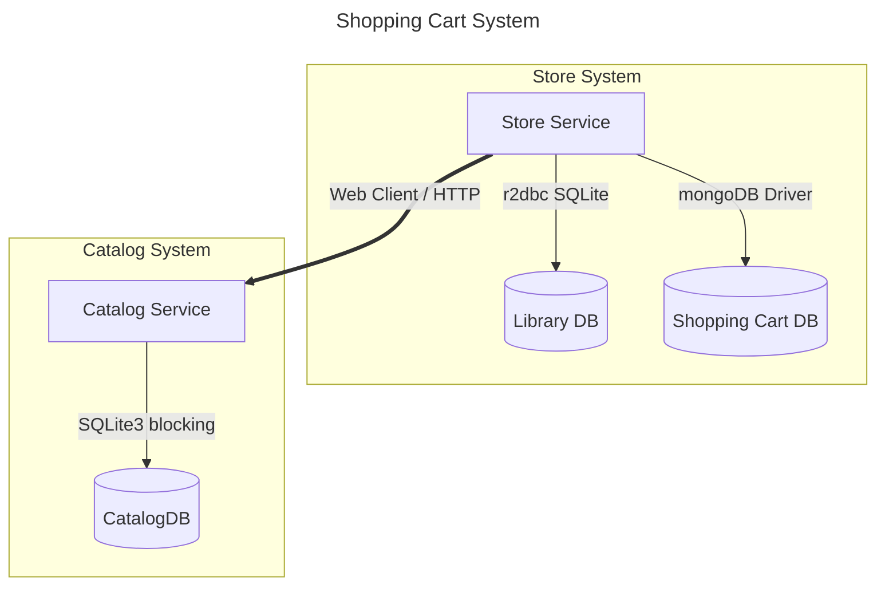

# Reactive Game Store Purchase System

Mini-project about a video game store system using reactive and legacy components, for educational purposes.

## Requirements
- Docker or Podman
- Java 17 (for manual deployment)
- Python 3.2 (for manual deployment)

## Optional
- [IntelliJ Mermaid Plugin](https://plugins.jetbrains.com/plugin/30432-mermaid-visualizer): To visualize mermaid diagrams in readme.md

# System architecture

