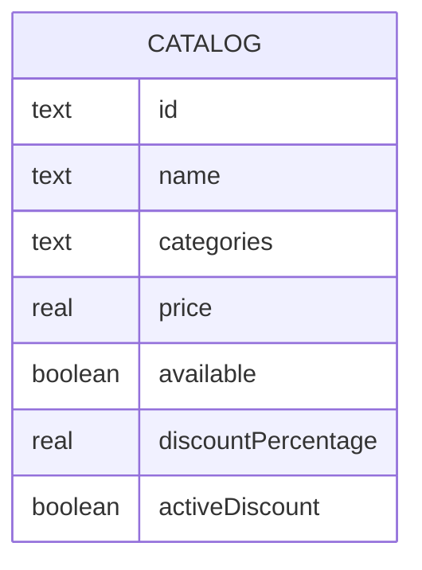

# Catalogue Service
This component represents a legacy catalogue system, simulating artificial latency for some games 
and using a blocking database connection. 

## Dependencies
- Docker or Podman 
- Docker Compose or Podman Compose
- Python 3.13 (for manual deployment)

## Simplifications
- Fusing catalogue and discount attributes for simplicity
- No currency, multiple purchasing, consumable types, or other considerations

## DB Modeling
Database Motor: SQLite



## Services

### List Games
Return all games in catalogue

### Get Game by ID
```json
{
  "id": "GAME-001",
  "name": "GAME 1",
  "categories": "Action;RPG",
  "price": 30.00,
  "available": true,
  "discountPercentage": 10.00,
  "activeDiscount": true
}
```

### Update Game
```json
{
  "available": false,
  "activeDiscount": true,
  "price": 25.00
}
```

## Execution

> ```bash
> cd catalogue-service
> ```

### Local Development (Python)
```bash
# Install dependencies
pip install -r requirements.txt

# Run the Flask server
python run.py
```

### Docker / Podman

```bash
cd ..
podman compose up -d catalogue-service
# or: docker compose up -d catalogue-service
```

### Cleanup (Keep Podman / Docker clean)

To stop and clean up containers, networks, volumes, and dangling images:

```bash
podman compose down -v
# or: docker compose down -v

# Prune unused/dangling build images to free up disk space
podman image prune -f
# or: docker image prune -f
```