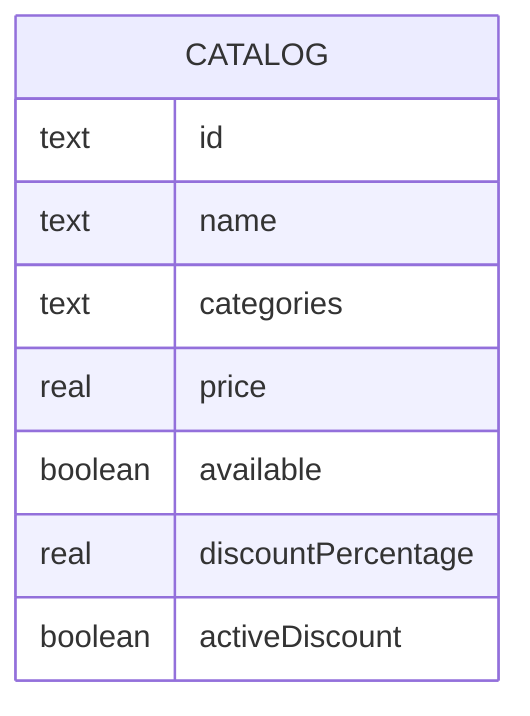

# Catalogue Service

This component represents a legacy catalogue system, simulating artificial latency for some games
and using a blocking database connection.

## Dependencies

- Docker or Podman
- Docker Compose or Podman Compose
- Python 3.13 (for manual deployment)

## Simplifications

- Fusing catalogue and discount attributes for simplicity
- No currency, multiple purchasing, consumable types, or other considerations

## Latency Simulation

This service intentionally simulates the behavior of a slow legacy system.
The following games introduce an artificial delay of **2.0 to 3.0 seconds** on `GET /games/{id}`:

| Game ID    | Simulated Behavior |
|------------|--------------------|
| `GAME-002` | Slow legacy game   |
| `GAME-004` | Slow legacy game   |
| `GAME-005` | Slow legacy game   |

## Initial State

The database is **re-seeded on every startup** (existing data is dropped and recreated). Initial catalogue:

| Game ID    | Name                    | Categories        | Price   | Available | Discount | Active Discount |
|------------|-------------------------|-------------------|---------|-----------|----------|-----------------|
| `GAME-001` | The Witcher 4           | Action;RPG        | $60.00  | ✅        | 10%      | ✅              |
| `GAME-002` | Cyberpunk 2078       | Action;Sci-Fi     | $50.00  | ✅        | 0%       | ❌              |
| `GAME-003` | Stardew Valley 2        | Simulation;RPG    | $20.00  | ✅        | 25%      | ✅              |
| `GAME-004` | Hollow Knight: Silksong | Action;Platformer | $30.00 | ✅        | 0%       | ❌              |
| `GAME-005` | Half-Life 3          | Action;Sci-Fi     | $70.00  | ❌        | 0%       | ❌              |
| `GAME-007` | Grand Theft Auto VI    | Action;Adventure  | $80.00  | ✅        | 0%       | ❌              |

## DB Modeling

Database Motor: SQLite



## Services

| Method  | Path          | Description                                              |
|---------|---------------|----------------------------------------------------------|
| `GET`   | `/games`      | List all games in the catalogue                          |
| `GET`   | `/games/{id}` | Get a single game by ID (may trigger latency simulation) |
| `PATCH` | `/games/{id}` | Update price, discount, or availability of a game        |

### List Games

Return all games in catalogue

### Get Game by ID

```json
{
  "id": "GAME-001",
  "name": "GAME 1",
  "categories": "Action;RPG",
  "price": 30.00,
  "available": true,
  "discountPercentage": 10.00,
  "activeDiscount": true
}
```

### Update Game

```json
{
  "available": false,
  "activeDiscount": true,
  "price": 25.00
}
```

## Execution

> ```bash
> cd catalogue-service
> ```

### Local Development (Python)

```bash
# Install dependencies
pip install -r requirements.txt

# Run the Flask server
python run.py
```

### Docker / Podman

```bash
cd ..
podman compose up -d catalogue-service
# or: docker compose up -d catalogue-service
```

### Cleanup (Keep Podman / Docker clean)

To stop and clean up containers, networks, volumes, and dangling images:

```bash
podman compose down -v
# or: docker compose down -v

# Prune unused/dangling build images to free up disk space
podman image prune -f
# or: docker image prune -f
```