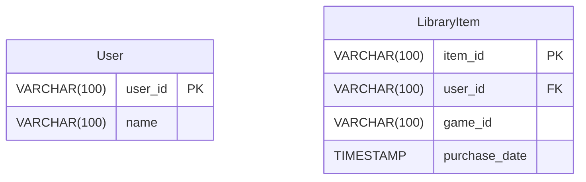
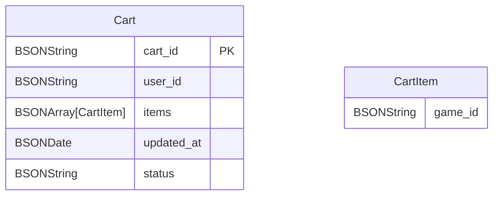

# Store Service

## Dependencies

- Lombok
- Spring Reactive Web
- Spring Data R2DBC
- R2DBC H2
- Spring Data Reactive MongoDB

## Simplifications

- Fusion shopping cart, library and user for simplicity
- Not available purchases for other person
- All the data will be related to a unique user, multi users will not be considered

## DB Modeling

DB Motor: H2



DB Motor: MongoDB



## Services

### List Cart

Return all games in catalogue

```json
{
  "cart_id": "CART-001",
  "user_id": "USER-001",
  "items": [
    {
      "id": "GAME-001",
      "original_price": 30.00,
      "final_price": 27.00,
      "discount": 3.0,
      "status": "OK"
    },
    {
      "id": "GAME-002",
      "original_price": 0.0,
      "final_price": 0.0,
      "discount": 0.0,
      "status": "NOT_AVAILABLE(BANNED | NOT PUBLISHED | RESTRICTED)",
      "disclaimer": "Not available product"
    },
    {
      "id": "GAME-003",
      "original_price": 30.00,
      "final_price": 30.00,
      "discount": 0.0,
      "status": "OWNED",
      "disclaimer": "Already owned"
    }
  ],
  "total": 57.0,
  "checkout_allowed": false,
  "validations": [
    "Remove unavailable games"
  ]
}
```

### Add to Cart

```json
{
  "game_id": "GAME-001"
}
```