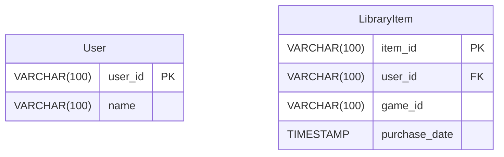
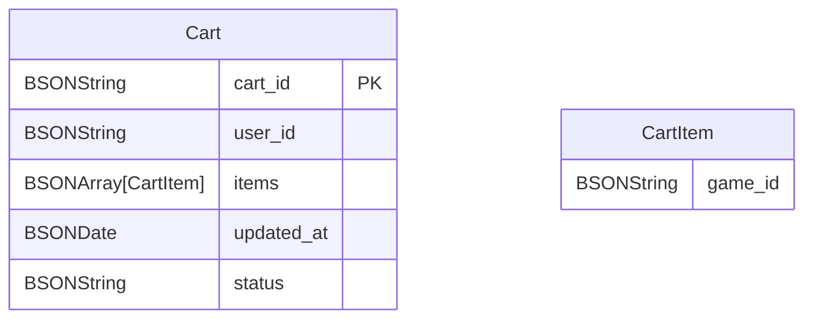

# Store Service

## Dependencies
- Lombok
- Spring Reactive Web
- Spring Data R2DBC
- R2DBC H2
- Spring Data Reactive MongoDB

## Simplifications
- Fusion shopping cart, library and user for simplicity
- Not available purchases for other person
- All the data will be related to a unique user, multi users will not be considered

## DB Modeling
DB Motor: H2


DB Motor: MongoDB


## Services

### List Cart
Return all games in catalogue

```json
{
  "cart_id": "cart_001",
  "items": [
    {
      "id": "GAME-001",
      "price": 27.00,
      "discount": 3.0,
      "status": "ALLOWED"
    },
    {
      "id": "GAME-002",
      "price": 0,
      "status": "NOT_AVAILABLE(BANNED | NOT PUBLISHED | RESTRICTED)",
      "statusMessage": "Not available"
    },
    {
      "id": "GAME-003",
      "price": 30.0,
      "status": "OWNED",
      "statusMessage": "Already owned"
    }
  ],
  "total": 57.0,
  "checkout_allowed": false,
  "validations": [
    "Remove owned games",
    "Remove not allowed games per ban, location restriction or availability"
  ]
}
```

### Add to Cart
```json
{
  "id": "GAME-001"
}
```